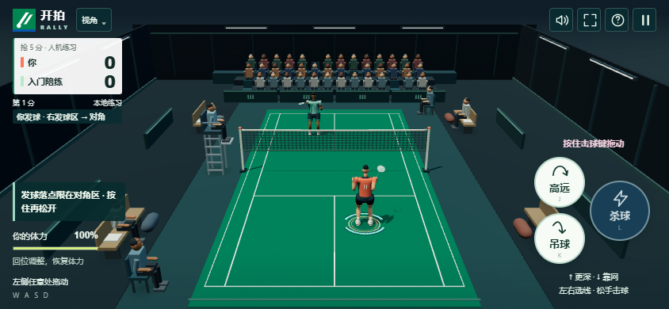

# 开拍 RALLY

A free, open-source 3D badminton game for mobile and desktop browsers.

1.2.0 正式版提供**人机练习＋双手机好友实时 1V1**，支持浮动摇杆、可调视角与本机好友战绩。两台手机直接打开网页即可建房、输码加入，无需用户电脑运行比赛服务器。项目使用 Three.js 和 PeerJS，可自行运行和修改，采用 [MIT 许可证](LICENSE)。不需要私人 API Key，也不需要购买服务器。

**[打开游戏：人机练习 / 好友 1V1 →](https://zcinta0514.github.io/rally-badminton/)** · 手机建议横屏。推荐双方连接同一 Wi-Fi 或支持设备互访的同一热点，建房和加入时保持互联网可用。



## 怎么和朋友联机

1. 两台手机打开上方游戏链接，推荐连接同一 Wi-Fi 或同一热点。
2. 点「好友对打」，填写昵称。房主选择角色、分制并创建房间。
3. 房主分享邀请链接或 **5 位房间码**，对方打开邀请链接或在游戏中输码加入。
4. 两人到齐后自动开始，结束后双方同意可再来一局。比赛时保持页面在前台。

默认使用免费的 PeerServer Cloud 公共服务完成房间配对，然后通过 WebRTC 在两台手机之间传输比赛数据，由房主手机计算移动、触球和得分。GitHub 入口不依赖用户电脑，关闭自己的电脑不会关闭这里创建的房间。

**建房、加入需要互联网；已经建立的直连在配对服务断开后仍可继续，前提是两台手机之间的连接保持可用。** 热点和路由器的设备隔离可能阻止连接，不能保证所有网络都能直连。公共配对服务有时可能不可达，无法建房时可稍后重试或继续人机练习。完全没有任何通信网络时，两台手机无法通过网页互联。

本版是邀请制好友对打，不提供随机匹配或全球排行榜。完整使用、故障排查和部署说明见 [运行指南](docs/DEPLOYMENT.md)。

## 本地运行与开发

安装 **Node.js 22 或更新版本**，然后执行：

```sh
git clone https://github.com/zcinta0514/rally-badminton.git
cd rally-badminton
npm ci
npm start
```

电脑打开 **http://localhost:3000/**。手机测试可打开启动终端显示的局域网网址；手机上的 `localhost` 指向手机自身。`npm start` 默认提供网页资源，前端仍使用手机直连模式，比赛由房主设备运行。访问或重新加载这个本地网址需要电脑提供网页；日常双手机游玩直接使用 GitHub 入口即可。

需要旧版 Node 房间与服务器排行榜时，设置 `PUBLIC_PEER_MODE=0` 后启动，具体命令见 [运行指南](docs/DEPLOYMENT.md#旧版-node-房间模式)。旧模式仍需主机电脑全程运行，与默认手机直连模式分开使用。

## 操作

| 操作 | 手机横屏 | 电脑 |
| --- | --- | --- |
| 移动 | 左半屏空白处按下出现摇杆，拖动移动，松手收起 | WASD / 方向键 |
| 高远 / 吊球 / 杀球 | 右侧三个击球按钮 | J / K / L |
| 力量与落点 | 按住击球键蓄力，同时拖动选落点，松手击球 | 鼠标拖动按钮；Z / X / C 预选线路 |
| 暂停 | 右上暂停按钮 | Esc |

先跑到来球附近再击球。青色圈提示来球落点，琥珀色弧提示接球位置，按住击球时的粉色圈表示意图落点。实际球路受站位、触球高度、移动、体力和蓄力影响。

## 已有功能

- 三种角色打法、三档人机；5 / 11 / 21 分快赛与简化标准三局赛。
- 房主手机计算真人比赛的移动、触球和得分；同步暂停和再战。直连中断后重新建房。
- 左上窄比分栏、浮动摇杆、多指击球、居中镜头与视角设置。
- 本机好友战绩按胜场、胜率、累计得分排序，统计本机参加的最近 500 场完整好友对局，显示前 50 位；人机练习和中途退出不计入。
- 原创连续蒙皮人物、关节与急停动作，16 羽片球体、触网摆动、冷暖场馆灯光和浏览器合成音效。
- 可信 HTTPS 页面可添加到主屏幕，完整缓存就绪后支持离线人机；配对好友仍需联网。

昵称与匿名玩家 ID 保存在当前浏览器，改名保留身份。换设备、换网站地址或清除网站数据不会自动接续原身份和战绩，同名也不能找回。每台手机只保存自己参加的对局，所以两人的本机榜可能不同；本机榜与旧版 Node 服务器榜独立，不合并旧榜单。浏览器无法保存时，本页仍显示临时战绩，关闭后新增记录会丢失。

## 开发

```sh
npm test
npm run build
```

构建导出自带 Three.js 和 PeerJS 的 `dist/` 静态包，默认启用手机直连。普通入口是 `/`，人物预览是 `/?preview=athlete`。本地服务启动时固定客户端资源，修改源码后需重启服务。

| 目录 | 作用 |
| --- | --- |
| `src/` | 输入、界面、渲染、手机直连与本机战绩 |
| `shared/` | 客户端与服务端共享的规则和球路计算 |
| `server/` | 本地网页服务与可选旧版 Node 房间、排行榜 |
| `scripts/` | 静态构建、离线缓存与图标生成 |
| `tests/` | 规则、输入、联机、持久化与渲染状态测试 |
| `deploy/` | 不含凭据的环境变量与 Nginx 示例 |

参与开发见 [贡献指南](CONTRIBUTING.md)，版本变化见 [CHANGELOG](CHANGELOG.md)，安全报告见 [SECURITY](SECURITY.md)。

## 当前边界

人物使用程序化动画，球路采用简化抛体模型，尚无完整空气阻力、专业动捕、随机匹配或跨设备账号。真实 iPhone 尚未实测，画面、触控和延迟仍需在目标手机上确认；不能把桌面运行结果当作手机性能结论。

公开内容不包含运行时玩家数据、证书、密钥或私人部署配置。依赖许可见 [第三方声明](THIRD_PARTY_NOTICES.md)。
